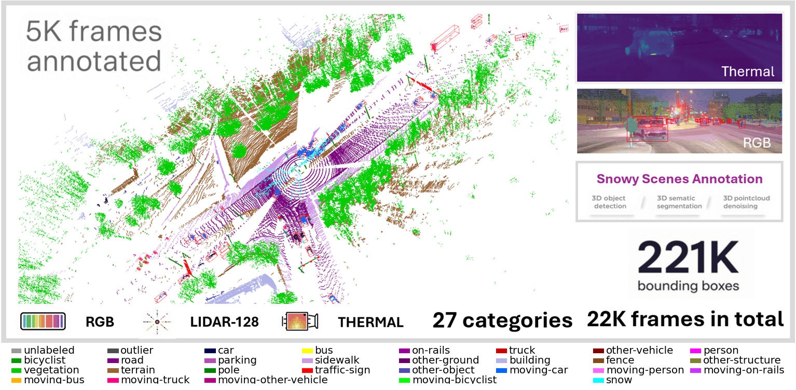
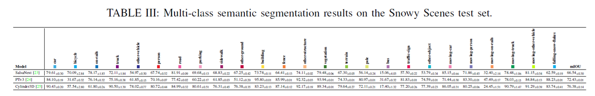
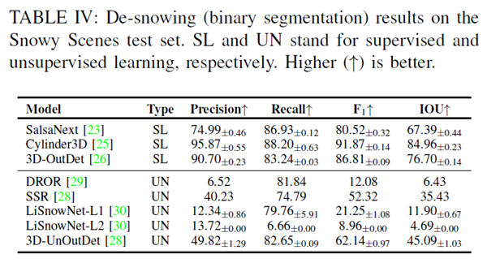
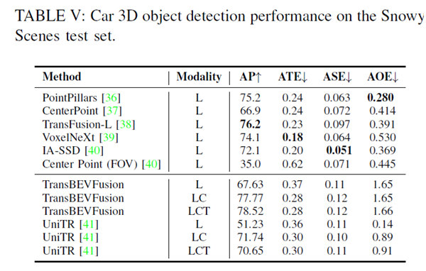
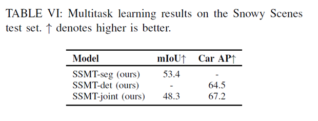

# Snowyscenes: A Multimodal Multitask Dataset Toward Snow-tonomous Vehicles

# Download
Email to (ms.thienthu.ngo@gmail.com) or (eren.aksoy@cs.lth.se)

## Snowy Scenes Dataset

**Snowy Scenes** is a multimodal multitask autonomous driving dataset designed for robust perception in snowy winter conditions. The dataset was collected in real-world urban and highway scenarios in Espoo, Finland, under accumulated snow, active snowfall, and late-evening snowy driving conditions.

The dataset contains **22,331 synchronized frames** collected over **14.4 km** of driving, with **5,027 expertly annotated LiDAR scans**. The sensor setup includes a high-resolution **128-beam LiDAR**, a front-facing **RGB camera**, three **thermal cameras**, and **GNSS/IMU** data for accurate ego-positioning and synchronization.

### Key Features

- **Real-world snowy driving data**
  - Captured only under snowy winter conditions
  - Includes accumulated snow, falling snow, and highway snow scenarios

- **Multimodal sensor setup**
  - 128-beam Velodyne VLS-128 LiDAR
  - 2.3 MP RGB front-facing camera
  - Three 0.3 MP thermal cameras
  - GNSS/IMU system for localization and synchronization

- **Rich 3D annotations**
  - 5,027 annotated LiDAR scans
  - 27 semantic classes
  - Point-wise semantic labels
  - Falling snowflake annotations
  - 221,081 3D bounding boxes

- **Supported perception tasks**
  - 3D semantic segmentation
  - 3D object detection
  - Point cloud denoising / de-snowing
  - Multitask 3D perception learning

### Dataset Split

The annotated data is split at the scene level:

| Split | Number of Scenes | Percentage |
|---|---:|---:|
| Training | 3,016 | 60% |
| Validation | 1,005 | 20% |
| Testing | 1,006 | 20% |

Each split preserves the same scene distribution: approximately **60% falling snow**, **20% highway snow**, and **20% accumulated snow**.

### Annotation Classes

Snowy Scenes provides point-wise annotations for **27 semantic categories**, including common road-scene classes such as cars, trucks, pedestrians, road, sidewalk, building, vegetation, terrain, traffic signs, poles, and a dedicated class for **falling snowflakes**.

### Benchmark Tasks

The dataset includes benchmark experiments for:

1. **3D Semantic Segmentation**  
   Models such as SalsaNext, PTv3, and Cylinder3D are evaluated. Cylinder3D achieves the highest semantic segmentation performance with an mIoU of **76.38**.
   

3. **Point Cloud De-snowing**  
   The dataset supports binary segmentation of snow particles versus regular LiDAR points. Cylinder3D achieves the strongest supervised de-snowing performance.
  

5. **3D Object Detection**  
   LiDAR-based and multimodal detection models are benchmarked for car detection. Sensor fusion using LiDAR, RGB, and thermal data improves detection performance.
  

7. **Multitask Learning**  
   Snowy Scenes also enables joint learning of semantic segmentation and object detection.
     

### Limitations

The dataset does not include radar data. RGB and thermal cameras are front-view limited, and annotations are provided for LiDAR data only. Other adverse weather conditions such as rain and fog are not included.
